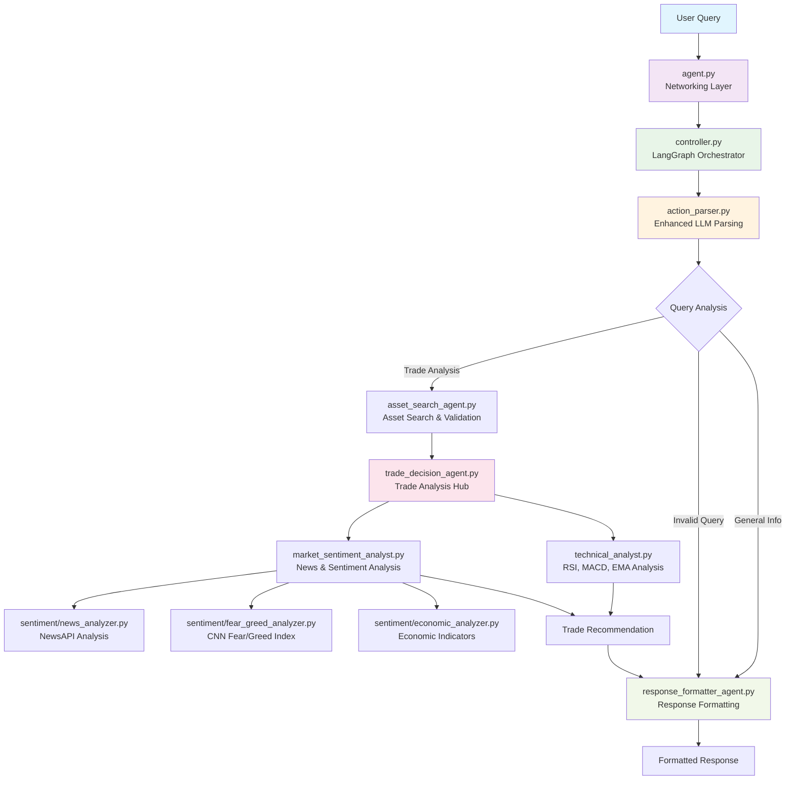
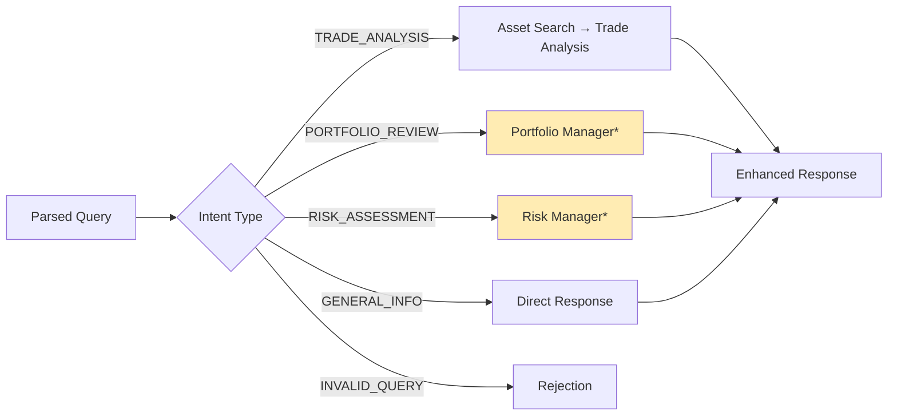

<div align="center">
     <br/>
    <strong>Build Agents, Not Infrastructure</strong> <br/>
<br />
</div>

# 🏦 AI Hedge Fund Agent

A sophisticated AI-powered hedge fund trading agent built with **LangGraph** orchestration, comprehensive market analysis, and intelligent routing. This agent provides professional-grade trading recommendations by analyzing technical indicators, market sentiment, and portfolio context.

## ✨ Key Features

- 🧠 **Enhanced LLM Query Parsing** - Single smart call extracts portfolio context, risk signals, and trade intent
- 📊 **Multi-Modal Analysis** - Technical indicators (RSI, MACD, EMA) + sentiment analysis + news
- 🎯 **Intelligent Routing** - LangGraph workflow adapts based on query complexity
- 💼 **Portfolio Awareness** - Understands existing positions and provides context-aware advice
- ⚡ **Real-Time Data** - Live market data from yfinance and CoinGecko APIs
- 🛡️ **Risk Detection** - Identifies risk concerns and routes to appropriate analysis
- 🎨 **Professional Formatting** - Beautiful, actionable responses with insights and recommendations

## 🏗️ Architecture Overview



## 📂 Project Structure

```
agents/hedge_fund/
├── agent.py                           # 🚀 Entry Point (43 lines)
├── agents/
│   ├── controller.py                  # 🎛️ LangGraph Orchestrator (499 lines)
│   ├── asset_search_agent.py          # 🔍 Asset Search & Validation (360 lines)
│   ├── response_formatter_agent.py    # 🎨 Response Formatting (399 lines)
│   ├── trade_decision_agent.py        # 📊 Trade Analysis Hub (663 lines)
│   ├── technical_analyst.py           # 📈 Technical Indicators (832 lines)
│   └── market_sentiment_analyst.py    # 📰 Sentiment Analysis (739 lines)
├── tools/
│   ├── action_parser.py               # 🧠 Enhanced LLM Parsing (266 lines)
│   ├── asset_search.py                # 🔧 Asset Search Tools (293 lines)
│   └── sentiment/                     # 📊 Sentiment Analysis Tools
│       ├── base.py                    # Core sentiment classes
│       ├── manager.py                 # Sentiment orchestration
│       ├── news_analyzer.py           # NewsAPI integration
│       ├── fear_greed_analyzer.py     # CNN Fear/Greed index
│       └── economic_analyzer.py       # Economic indicators
```

## 🚀 Quick Start

### Prerequisites

- **Python**: 3.10+
- **UV**: 0.5.25+ ([Documentation](https://docs.astral.sh/uv/))

### Authentication

```bash
agentuity login
```

### Development Mode

```bash
agentuity dev
```

This opens the Agentuity Console for real-time testing.

### Example Queries

The agent handles various types of trading queries:

```
🔹 Simple Analysis: "Should I buy Apple stock?"
🔹 Portfolio Context: "I own 100 shares of Tesla, should I buy more?"
🔹 Risk Assessment: "Is my portfolio too risky with 50% tech stocks?"
🔹 Market Updates: "How is Bitcoin doing today?"
🔹 General Info: "What is RSI?"
🔹 Comparisons: "AAPL vs MSFT which is better?"
```

## 🧠 Enhanced Query Processing

Our **single smart LLM call** extracts comprehensive information:

```python
ParsedAction:
├── intent_type: "trade_analysis" | "portfolio_review" | "risk_assessment"
├── primary_asset: "Tesla" | "Bitcoin" | "AAPL"
├── mentioned_positions: [{"asset": "Tesla", "quantity": "100 shares"}]
├── risk_keywords: ["risky", "diversification", "volatile"]
├── quantities: [{"amount": "50", "unit": "percent"}]
├── trade_intent_strength: 0.9 (high conviction)
├── portfolio_context_strength: 0.8 (strong portfolio context)
└── risk_concern_level: 0.6 (moderate risk concern)
```

## 📊 Analysis Pipeline

### 1. Technical Analysis
- **SMA/EMA**: 8/21 crossover system
- **RSI**: Overbought/oversold signals (14-period)
- **MACD**: Trend confirmation and momentum
- **Volume Analysis**: Trend confirmation

### 2. Sentiment Analysis
- **News Sentiment**: Real-time news analysis via NewsAPI
- **Fear/Greed Index**: CNN market sentiment indicator
- **Economic Indicators**: VIX, bond yields, economic data

### 3. Enhanced Insights
- **AI-Generated Themes**: Market-moving narratives
- **Risk Factor Detection**: Potential downside risks
- **Event Awareness**: Earnings, Fed meetings, economic releases

## 🎯 Intelligent Routing

The LangGraph controller routes queries based on extracted information:


*Future enhancements

## 🛡️ Risk Management (Future)

Planned risk management capabilities:
- Portfolio diversification analysis
- Position sizing recommendations
- Risk/reward ratio calculations
- Correlation analysis
- VaR (Value at Risk) calculations

## 🏗️ Deployment

### Local Development
```bash
agentuity dev
```

### Cloud Deployment
```bash
agentuity deploy
```


## 📈 Example Output

```
🚀 Good timing for buying Apple Inc (AAPL)!

📈 Decision: BUY
🎯 Confidence: HIGH (87.5%)
💰 Current Price: $195.32
🏢 Exchange: NASDAQ

Key Factors:
1. Strong EMA 8/21 bullish crossover with increasing momentum
2. RSI at healthy 58.7 level with room for upside
3. Positive sentiment from strong earnings and iPhone demand

AI Insights:
🧠 Market Themes: AI integration, services growth, China recovery
📰 Key Events: Q4 earnings beat, new Vision Pro launch
⚠️ Risk Factors: Rising interest rates, China tensions

Analysis: Technical indicators show strong bullish momentum with the EMA crossover 
confirming the uptrend. Sentiment analysis reveals positive market reception to 
recent earnings and product launches...

*Analysis completed at 2024-01-15 14:30:22*
```

## 🤝 Contributing

This is a production-ready hedge fund agent with clean, modular architecture. Key principles:

- **Single Responsibility**: Each agent has one clear purpose
- **Clean Dependencies**: No circular imports or legacy code
- **Enhanced Parsing**: Rich context extraction from user queries
- **Professional Output**: Actionable, well-formatted responses

## 📚 Documentation

- [Agentuity Python SDK](https://agentuity.dev/SDKs/python)
- [LangGraph Documentation](https://python.langchain.com/docs/langgraph)
- [Technical Analysis Library](https://technical-analysis-library-in-python.readthedocs.io/)

## 🆘 Support

- [Discord Community](https://discord.com/invite/vtn3hgUfuc)
- [Agentuity Support](https://agentuity.dev/support)

---

<div align="center">
<strong>Built with ❤️ using Agentuity, LangGraph, and advanced AI techniques</strong>
</div>
