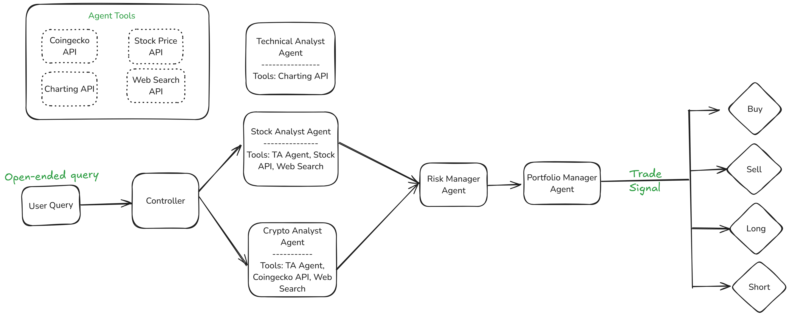

# AI Hedge Fund Agent Design Document

**Project Inspiration:** [https://github.com/virattt/ai-hedge-fund?tab=readme-ov-file](https://github.com/virattt/ai-hedge-fund?tab=readme-ov-file)

---

## Overview

This AI hedge fund system processes open-ended user queries about financial assets and autonomously generates trade decisions (Buy, Sell, Long, Short). It includes specialized agents, each responsible for a critical stage in the decision-making pipeline — from asset analysis to risk management and portfolio allocation.

---
## Agent Components

### 1. User Query
- **Function:** Initiates an open-ended question (e.g., "Should I buy ETH now?", "What’s the best tech stock to short?")
- **Output:** Sent to the Controller for routing

### 2. Controller
- **Function:**
  - Interprets the query and determines which analysis path to follow (crypto, stock, or both)
  - Routes the query to relevant agents

- **Logic:**
  - If asset = crypto → Crypto Analyst Agent  
  - If asset = stock → Stock Analyst Agent

### 3. Technical Analyst Agent
- **Function:**
  - Performs chart-based technical analysis (applies to both stocks and crypto)
  - Identifies patterns, trends, and momentum using:
    - EMA / SMA (Moving Averages)
    - MACD (Momentum)
    - RSI (Overbought/Oversold)
    - Bollinger Bands (Volatility)
    - Support/Resistance levels
    - Volume analysis
- **Output:** Structured analysis with bullish/bearish signals and confidence levels

### 4. Crypto Analyst Agent
- **Function:**
  - Analyzes crypto-specific fundamentals:
    - Tokenomics
    - On-chain metrics (e.g., active addresses, gas fees)
    - Developer activity
    - Governance structure
    - Sentiment from news, social media
- **Output:** Health score and forward-looking outlook

### 5. Risk Manager Agent
- **Function:**
  - Integrates analysis from both Technical and Crypto agents
  - Evaluates:
    - Volatility
    - Drawdown potential
    - Market correlations
    - Position sizing recommendations
  - Applies constraints or flags overexposure
- **Output:** Risk-adjusted version of the original signal

### 6. Portfolio Manager Agent
- **Function:**
  - Matches risk-adjusted trade ideas to portfolio strategy
  - Allocates capital based on:
    - Current exposure
    - Sector/asset diversification
    - Portfolio goals (e.g., growth, preservation)
  - Decides on the appropriate Trade Signal
- **Output:** Final decision: Buy / Sell / Long / Short

### 7. Trade Signal Executor
- **Function:**
  - Receives action from Portfolio Manager
  - Sends signal back as the response
- **Signals:**
  - ✅ Buy — initiate or increase position
  - ❌ Sell — reduce or close position
  - 📈 Long — leverage bullish thesis (e.g., margin, calls)
  - 📉 Short — leverage bearish thesis (e.g., shorts, puts)

---

## Future Extensions

- Add Macro Analyst Agent (interest rates, CPI, etc.)
- Add Backtesting Agent for continuous learning
- Add Trade Executor Agent to interface with brokers/exchanges
- Integrate Explainability Module for user rationale of trade decisions

---

## Key Design Principles

- **Agent-based modularity:** Each component is decoupled and responsible for a narrow task.  
- **Extensible:** Easy to plug in new tools, agents, or strategies.  
- **Multi-asset:** Works across crypto and traditional finance.  
- **Risk-aware:** No decision bypasses the risk evaluation step.
