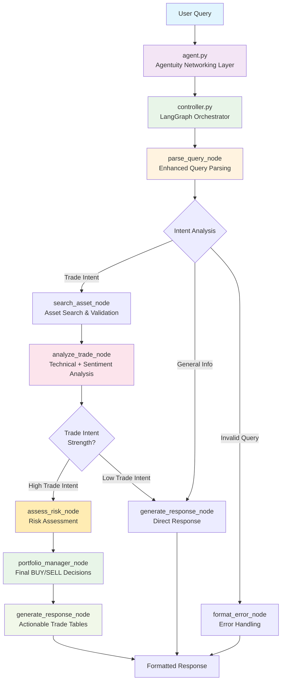
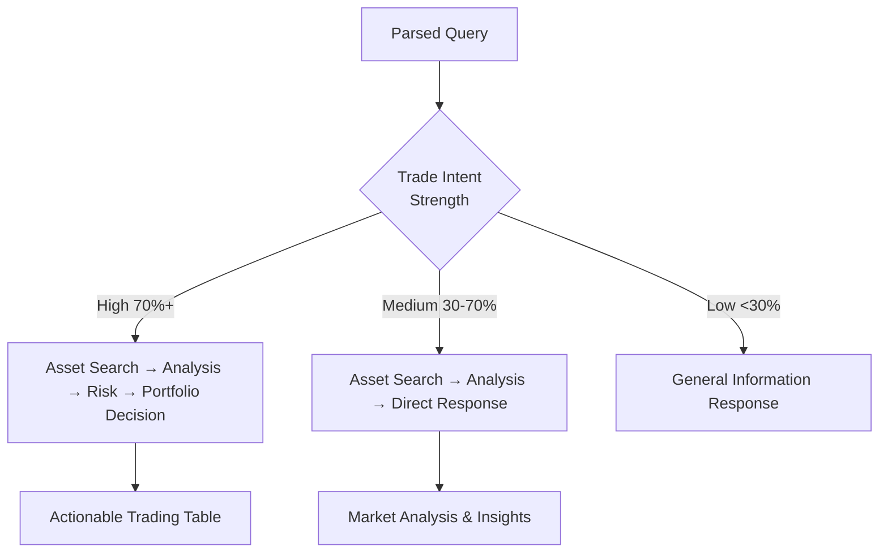

# 🏗️ AI Hedge Fund Agent - Architecture

## 🏗️ Complete Workflow Architecture



## 🔄 Step-by-Step Workflow

### 1. **Query Parsing** (`parse_query_node`)
- Enhanced LLM extraction of user intent, trade signals, and portfolio context
- Determines routing based on intent type (trade analysis vs general info)
- Extracts existing positions, risk tolerance, and trade intent strength

### 2. **Asset Search** (`search_asset_node`)
- Validates and searches for requested assets (stocks, crypto, ETFs)
- Fetches real-time market data and asset information
- Routes invalid assets to error handling

### 3. **Trade Analysis** (`analyze_trade_node`)
- **Technical Analysis**: RSI, MACD, EMA 8/21 crossovers, volume analysis
- **Sentiment Analysis**: News sentiment, Fear/Greed index, economic indicators
- **AI Insights**: Market themes, risk factors, upcoming events
- Routes based on trade intent strength and actionable recommendations

### 4. **Risk Assessment** (`assess_risk_node`) *[When High Trade Intent]*
- Portfolio risk evaluation and position sizing recommendations
- Risk level assessment (LOW/MEDIUM/HIGH)
- Warning generation for concentration risks and market volatility
- Should-proceed recommendations with detailed reasoning

### 5. **Portfolio Management** (`portfolio_manager_node`) *[Final Decision Making]*
- **Concrete Decisions**: BUY, SELL, or HOLD with specific quantities
- **Position Sizing**: Calculated based on risk assessment and portfolio constraints
- **Price Targets**: Entry prices, stop losses, and take profit levels
- **Cash Management**: Post-trade cash allocation and portfolio balance

### 6. **Response Generation** (`generate_response_node`)
- **Portfolio Decisions**: Actionable trading tables with concrete quantities
- **Analysis-Only**: Market insights and recommendations without specific trades
- **Error Handling**: Professional error messages with helpful suggestions

## 📊 Technical Analysis Pipeline

### Real-Time Indicators
- **EMA 8/21 Crossovers**: Primary trend identification system
- **RSI (14-period)**: Overbought/oversold momentum signals
- **MACD**: Trend confirmation and momentum analysis
- **Volume Analysis**: Trend strength validation
- **Support/Resistance**: Key price level identification

### Sentiment Analysis
- **News Sentiment**: Real-time analysis via NewsAPI
- **Fear/Greed Index**: CNN market sentiment indicator  
- **Economic Indicators**: VIX volatility, bond yields, economic calendar
- **AI-Generated Themes**: Market-moving narratives and catalysts

### Enhanced Insights
- **Risk Factor Detection**: Potential downside scenarios
- **Event Awareness**: Earnings, Fed meetings, economic releases
- **Correlation Analysis**: Asset relationship mapping

## 💼 Portfolio Decision Engine

The portfolio manager makes final trading decisions based on:

- **Technical Analysis Results**: Bullish/bearish signals and strength
- **Risk Assessment**: Position sizing and risk-adjusted recommendations  
- **User Context**: Existing positions, risk tolerance, available cash
- **Market Conditions**: Volatility, sentiment, and economic backdrop

### Decision Output Format

**BUY/SELL Decisions** include:
- Specific share quantities and dollar amounts
- Entry price recommendations
- Stop loss and take profit levels
- Position size as percentage of portfolio
- Risk level and confidence scores
- Detailed reasoning and next steps

**HOLD Decisions** include:
- Current position evaluation
- Reason for holding (mixed signals, wait for clarity)
- Next review timeline
- Monitoring suggestions

## 📋 Example Workflow: "Should I buy Tesla?"

1. **Parse Query**: Detects trade intent (85%), Tesla as primary asset
2. **Search Asset**: Finds TSLA, current price $195.32, validates market data
3. **Trade Analysis**: 
   - Technical: EMA crossover bullish, RSI 58.7 (healthy)
   - Sentiment: Positive from earnings beat, AI integration themes
   - Decision: BUY with HIGH confidence
4. **Risk Assessment**: MEDIUM risk due to tech sector volatility
5. **Portfolio Decision**: BUY 25 shares (~$4,883), 10% portfolio allocation
6. **Response**: Actionable trading table with specific recommendations

## 📂 Project Structure

```
agents/hedge_fund/
├── agent.py                          # 🚀 Agentuity Networking Layer
├── services/
│   ├── controller.py                 # 🎛️ LangGraph Workflow Orchestrator
│   ├── trade_decision_service.py     # 📊 Technical + Sentiment Analysis Hub
│   ├── risk_manager_service.py       # 🛡️ Risk Assessment & Position Sizing
│   ├── technical_analyst.py          # 📈 Technical Indicators & Signals
│   └── market_sentiment_analyst.py   # 📰 News & Market Sentiment Analysis
├── nodes/                            # 🔗 LangGraph Workflow Nodes
│   ├── parsing.py                    # 🧠 Enhanced Query Parsing
│   ├── search.py                     # 🔍 Asset Search & Validation
│   ├── analysis.py                   # 📊 Trade Analysis Coordination
│   ├── risk_management.py            # 🛡️ Risk Assessment Node
│   ├── portfolio_manager.py          # 💼 Final Trading Decisions
│   └── llm_response.py               # 🎨 Response Formatting & Tables
├── tools/
│   ├── action_parser.py              # 🧠 Enhanced LLM Query Understanding
│   ├── asset_search.py               # 🔧 Asset Search & Market Data
│   ├── technical/                    # 📈 Technical Analysis Tools
│   │   ├── indicators.py             # RSI, MACD, EMA calculations
│   │   ├── signal_interpreter.py     # Signal strength analysis
│   │   └── data_fetcher.py           # Real-time market data
│   └── sentiment/                    # 📊 Sentiment Analysis Tools
│       ├── news_analyzer.py          # NewsAPI integration
│       ├── fear_greed_analyzer.py    # CNN Fear/Greed index
│       └── economic_analyzer.py      # Economic indicators
└── models/                           # 🏗️ Data Models & Types
    ├── action.py                     # Query parsing models
    ├── workflow.py                   # LangGraph state management
    ├── portfolio_decision.py         # Trading decision models
    └── user_context.py               # User portfolio & preferences
```

## 🎯 Intelligent Routing Logic

The LangGraph controller routes queries based on extracted intelligence:



**High Trade Intent Examples:**
- "Should I buy Tesla?"
- "I want to invest $5000 in tech stocks"
- "Time to sell my Bitcoin?"

**Medium Trade Intent Examples:**
- "How is Apple performing?"
- "What's the outlook for crypto?"
- "Tesla vs Ford comparison"

**Low Trade Intent Examples:**
- "What is technical analysis?"
- "Explain RSI indicator"
- "How do markets work?"

## 📈 Example Actionable Output

**High Trade Intent Query**: *"Should I buy Apple stock?"*

```
┌─── 📊 TRADING DECISION ───┐
│ Symbol          │ AAPL             │
│ Action          │ BUY              │
│ Quantity        │ 25 shares        │
│ Current Price   │ $195.32          │
│ Total Cost      │ $4,883.00        │
│ Stop Loss       │ $175.50          │
│ Take Profit     │ $220.00          │
│ Position Size   │ 9.8% portfolio   │
│ Risk Level      │ MEDIUM           │
│ Confidence      │ HIGH (87.5%)     │
└─────────────────┴──────────────────┘

💡 **Action Required:**
• Execute BUY order for 25 shares
• Set stop loss at $175.50 (-10.1%)
• Target price $220.00 (+12.6%)

💭 **Key Factors:**
1. Strong EMA 8/21 bullish crossover with momentum
2. RSI at healthy 58.7 with room for upside  
3. Positive earnings sentiment and AI integration themes

🧠 **AI Insights:**
Market Themes: AI integration, services growth, Vision Pro launch
Risk Factors: Rising rates, China tensions, tech rotation risk
```

**Medium Trade Intent Query**: *"How is Apple looking?"*

```
🍎 Apple Inc (AAPL) Analysis

📈 **Technical Outlook**: BULLISH
Current Price: $195.32 | RSI: 58.7 | MACD: Bullish crossover

**Key Signals:**
✅ EMA 8/21 bullish crossover confirms uptrend
✅ Volume supporting price action  
⚠️ Approaching resistance at $200

📰 **Sentiment**: POSITIVE (78%)
Recent earnings beat expectations, strong iPhone sales in China

🎯 **Outlook**: Good technical setup for continued upside toward $220
```

## 🛡️ Risk Management Features

- **Position Sizing**: Automatic calculation based on portfolio size and risk tolerance
- **Risk Level Assessment**: LOW/MEDIUM/HIGH with detailed reasoning
- **Stop Loss Recommendations**: Technical level-based exit strategies
- **Concentration Risk**: Warnings for over-allocation to single positions
- **Volatility Adjustment**: Position size reduction for high-volatility assets
- **Portfolio Balance**: Cash allocation and diversification recommendations

## 🤝 Contributing

This is a production-ready hedge fund agent with clean, modular architecture. Key principles:

- **Single Responsibility**: Each node/service has one clear purpose
- **Clean Dependencies**: No circular imports or legacy code
- **Enhanced Parsing**: Rich context extraction from user queries
- **Actionable Output**: Concrete trading decisions with specific quantities
- **Professional Risk Management**: Comprehensive position sizing and risk assessment
- **Agentuity Native**: Built for optimal Agentuity platform performance 